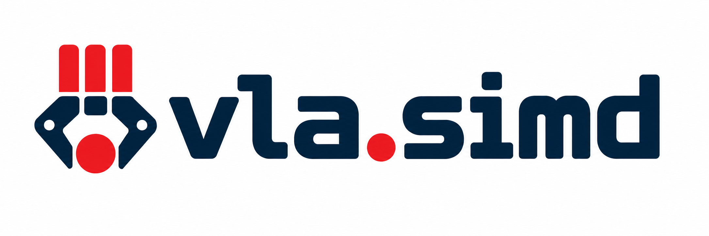

<div align="center">
  

<h1 style="border: none;">vla.simd</h1>

<p><b>Efficient CPU Inference for Language-Conditioned Manipulation</b></p>

<p>
    <a href="https://arxiv.org/abs/2609.24274">📑 Paper</a> |
    <a href="https://vla-simd.github.io/">🌐 Project Page</a>
</p>

</div>

A pure C++ inference engine for Vision-Language-Action policies on **CPUs**,
with no GPU, CUDA, or ggml dependency. Built with its own tensors, operators,
and SIMD kernels, the engine keeps kernels easy to inspect, tune, and replace.

One codebase supports x86-64, Apple Silicon, and Raspberry Pi. CMake configures
the target's instruction-set flags, while the hardware abstraction layer
selects AVX2 kernels tuned for Intel or AMD Zen, NEON kernels for ARM with
Accelerate support on Apple Silicon, or a portable scalar fallback.

## Build

```sh
cmake -S . -B build && cmake --build build -j"$(getconf _NPROCESSORS_ONLN)"
ctest --test-dir build --output-on-failure
```

Apple Silicon needs Homebrew's OpenMP first: `brew install cmake libomp`.
Presets (`cmake --preset <name>`): `release`, `debug`, `ci` (release plus
`-Werror`). Configure with `-DVLA_SANITIZE=address,undefined` for a sanitizer
build.

## Convert

The engine loads flat `.meta`/`.bin` arenas, not framework checkpoints, so every
policy is converted once, offline. No converter runs at serve time: the server
still installs torch for lerobot's wire types, but builds no torch model.

**A torch converter must run in the environment its checkpoint was trained in**,
not one shared venv. Five environments cover the six policies, all of them
extras in [pyproject.toml](pyproject.toml):

| venv | install | Python | converts |
| --- | --- | --- | --- |
| `.lerobot` | `-e '.[lerobot]'` | >=3.12 | ACT, Diffusion Policy, SmolVLA |
| `.impact` | `-e '.[impact]'` | >=3.12 | IMPACT (from the lerobot fork) |
| `.turbovla` | `-e '.[turbovla]'` | >=3.10 | TurboVLA |
| `.octo` | `-e '.[octo]'` | 3.10 or 3.11 | Octo (x86-64 or macOS) |
| `.numpy` | `-e '.[numpy]'` | >=3.10 | SmolVLA (torch-free) |

Create only the one you need:

```sh
uv venv .numpy --prompt numpy                   && uv pip install --python .numpy    -e '.[numpy]'
uv venv .lerobot --prompt lerobot --python 3.12 && uv pip install --python .lerobot  -e '.[lerobot]'  --torch-backend cpu
uv venv .impact --prompt impact --python 3.12   && uv pip install --python .impact   -e '.[impact]'   --torch-backend cpu
uv venv .turbovla --prompt turbovla             && uv pip install --python .turbovla -e '.[turbovla]' --torch-backend cpu

# TurboVLA also needs the upstream checkout and its released checkpoint
git clone https://github.com/H-EmbodVis/TurboVLA third_party/TurboVLA
.turbovla/bin/hf download H-EmbodVis/TurboVLA checkpoints/libero/turbovla_libero.pth --local-dir build/turbovla_ckpt

# Octo also needs the upstream checkout, installed without its own pins
uv venv .octo --prompt octo --python 3.10 && uv pip install --python .octo -e '.[octo]'
git clone https://github.com/octo-models/octo third_party/octo
uv pip install --python .octo -e third_party/octo --no-deps
```

Convert once per checkpoint:

```sh
# IMPACT
.impact/bin/python tools/convert_impact.py --ckpt <hub-id-or-dir> --out build/impact

# ACT
.lerobot/bin/python tools/convert_act.py --ckpt <hub-id-or-dir> --out build/act

# Diffusion Policy
.lerobot/bin/python tools/convert_diffusion.py --ckpt <dir> --out build/diffusion

# SmolVLA, with torch or without. --pos-ids is shifted for transformers
# 4.55-4.57 and identity otherwise (lerobot >= 0.5 trains with transformers 5)
.lerobot/bin/python tools/convert_lerobot_ckpt.py --ckpt <dir> --out build/smolvla
.numpy/bin/python tools/convert_hf_safetensors.py <hub-id-or-dir> build/smolvla --pos-ids identity

# TurboVLA
.turbovla/bin/python tools/convert_turbovla.py --out build/turbovla \
    --ckpt build/turbovla_ckpt/checkpoints/libero/turbovla_libero.pth

# Octo base model and tokenizer
.octo/bin/python tools/convert_octo.py build/octo
.octo/bin/python tools/convert_t5_tokenizer.py build/octo/tok

# Octo finetune saved by lerobot; needs a lerobot that ships
# lerobot.policies.octo (0.6.1 does not)
python tools/convert_lerobot_octo.py --ckpt <hub-id-or-dir> --t5-from build/octo --out build/octo_so101
```

## Checkpoints

The policies evaluated in the paper are public on the Hugging Face Hub:

| policy | checkpoints |
| --- | --- |
| ACT | [act-matched_so101-multi-task-clean](https://huggingface.co/khanhnd61/act-matched_so101-multi-task-clean) |
| IMPACT | [impact_so101-multi-task-clean](https://huggingface.co/khanhnd61/impact_so101-multi-task-clean), [impact-int8_so101-multi-task-clean](https://huggingface.co/khanhnd61/impact-int8_so101-multi-task-clean) (trained for W8A8, serve with `--int8 63`), [impact_libero_spatial](https://huggingface.co/khanhnd61/impact_libero_spatial), [impact_libero_object](https://huggingface.co/khanhnd61/impact_libero_object), [impact_libero_goal](https://huggingface.co/khanhnd61/impact_libero_goal), [impact_libero_10](https://huggingface.co/khanhnd61/impact_libero_10) |
| SmolVLA | [smolvla_so101-multi-task-clean](https://huggingface.co/khanhnd61/smolvla_so101-multi-task-clean), [smolvla-prune10_so101-multi-task-clean](https://huggingface.co/khanhnd61/smolvla-prune10_so101-multi-task-clean) |
| Octo | [octo-small_so101-multi-task-clean](https://huggingface.co/khanhnd61/octo-small_so101-multi-task-clean), base [rail-berkeley/octo-small-1.5](https://huggingface.co/rail-berkeley/octo-small-1.5) |
| TurboVLA | [H-EmbodVis/TurboVLA](https://huggingface.co/H-EmbodVis/TurboVLA) (LIBERO) |

## Serve

Serving is one environment for every policy, and the only one the robot needs:

```sh
uv venv .serve --prompt serve --python 3.12
uv pip install --python .serve -e '.[serve]' --torch-backend cpu
```

One `serve/policy_server.py` serves every policy; `--model` picks which, and
`$CORES` is the OpenMP thread count:

```sh
export CORES=6    # 8 on the M4, 16 on the i9, 12 on the Ryzen, 4 on a Pi 5

OMP_NUM_THREADS=$CORES .serve/bin/python serve/policy_server.py \
    --model <name> --model-dir build/<name> --port 8080
```

| `--model` | notes |
| --- | --- |
| `impact`, `act`, `smolvla` | nothing extra |
| `turbovla` | add `--task "<instruction>"` unless converted with one; frames consumed as given, at the checkpoint's resolution |
| `octo` | add `--cams front,wrist`, the robot's camera names, primary first; the converter records none. `--cams front` serves a robot without a wrist camera |
| `diffusion` | prefix `DP_SCHEDULER=DDIM DP_STEPS=10`; the 2-frame history is assembled from the stream |

Octo and Diffusion Policy see consecutive frames only if the client sends every
frame, so run the client with `--chunk_size_threshold=1.0` for them.

`--bench N` (or `--soak SEC`; `--json` for JSON output) times N queries after
warmup and exits, reporting the backend it ran on.
`--int8 MASK` runs the W8A8 path on CPUs with AVX-VNNI or dotprod:

| knob | effect |
| --- | --- |
| `--int8 MASK` | `ACT_INT8` / `IMPACT_INT8`: 1 encoder attention, 2 encoder w1, 4 encoder w2, 8 token projections, 16 decoder, 32 ResNet convolutions. `SMOLVLA_INT8`: 1/2/4 ViT attention/w1/w2, 8 ViT patch embed and connector, 16 language model, 32 action expert. `OCTO_INT8`: 1/2/4 transformer attention/w1/w2, 8 token projections, 16 stem convolutions, 32 diffusion head |
| `DP_SCHEDULER`, `DP_STEPS` | Diffusion Policy sampler (`DDPM` or `DDIM`) and step count |
| `SMOLVLA_NUM_STEPS` | SmolVLA flow-matching steps |
| `--rtc-horizon H` | SmolVLA real-time chunking (lerobot's RTC): guide each chunk toward the previous one's unexecuted actions over the next H (0, the default, is off). `--rtc-max-guidance` caps the guidance weight (10), `--rtc-delay D` fixes the frozen prefix instead of measuring it from latency and `--fps`. Run the client with `--aggregate_fn_name=latest_only`, and raise `--rtc-delay` when the network adds latency |
| `TCPU_VIEW_THREADS`, `TCPU_EXPERT_THREADS`, `TCPU_OMP_MIN` | threading of the camera views, the SmolVLA expert loop, and the size below which small ops stay single-threaded |
| `TCPU_ZEN=0`, `TCPU_ZEN=1` | force the Intel or the AMD Zen attention layout on x86; the default follows the CPU vendor |
| `TCPU_BF16_MLP=1`, `TCPU_BF16_DEQ=0` | bf16 MLP weights on the Pi; keep bf16 checkpoint weights resident on x86 |

The server is a drop-in replacement for `lerobot.async_inference.policy_server`,
so the robot side runs lerobot unchanged except for its client,
`lerobot-vla-simd`, which ships in the
[lerobot fork](https://github.com/khanhnd61-vr/lerobot):

```sh
uv pip install --python .serve \
    'lerobot[async,feetech] @ git+https://github.com/khanhnd61-vr/lerobot@4b33b84296c0880ebce778d69f16a38d33825575'

.serve/bin/lerobot-vla-simd --server_address=127.0.0.1:8080 --policy_type=<name> \
    --robot.type=so101_follower \
    --robot.port=/dev/ttyACM0 --robot.id=my_arm \
    --robot.cameras="{ front: {type: opencv, index_or_path: 0, width: 640, height: 480, fps: 30}, wrist: {type: opencv, index_or_path: 2, width: 640, height: 480, fps: 30} }" \
    --actions_per_chunk=50 \
    --task="pick up the tape"
```

## Citation

```bibtex
@article{nguyen2026vlasimd,
  title   = {{vla.simd}: Efficient {CPU} Inference for Language-Conditioned Manipulation},
  author  = {Nguyen, Khanh D. and Truong, Hoang M. and Le, An T.},
  journal = {arXiv preprint arXiv:2609.24274},
  year    = {2026}
}
```

## License

`vla.simd` is released under the [Apache 2.0 license](LICENSE).

## Acknowledgement

- [ACT](https://huggingface.co/papers/2304.13705) and [lerobot](https://github.com/huggingface/lerobot) - the reference implementations and the async-inference protocol
- [Octo](https://github.com/octo-models/octo) - the authoritative JAX model
- [TurboVLA](https://github.com/H-EmbodVis/TurboVLA) - the LIBERO checkpoints
- [Diffusion Policy](https://arxiv.org/abs/2303.04137) - the U-Net action denoiser (Chi et al., 2023)
- [TinyChatEngine](https://github.com/mit-han-lab/TinyChatEngine) - CPU ops for LLMs, not based on ggml
- [VAMP](https://github.com/KavrakiLab/vamp) - SIMD accelerator in the same robotics domain
