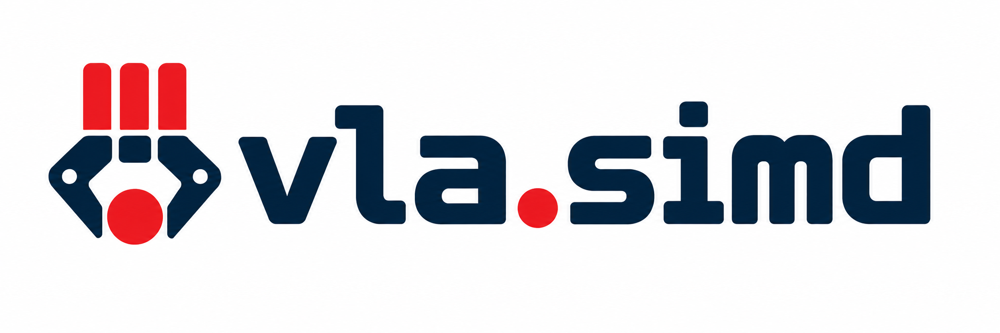

<div align="center">
  

<h1 style="border: none;">vla.simd</h1>

<p><b>Efficient CPU Inference for Language-Conditioned Manipulation</b></p>

<p>
    <a href="https://arxiv.org/abs/2609.24274">
      
    </a>
    <a href="https://vla-simd.github.io/">
      
    </a>
    <a href="https://huggingface.co/collections/khanhnd61/vlasimd-model-bundle-6ab649fa9d1f2e8b66512a31">
      
    </a>
</p>

</div>

A C++ inference engine for Vision-Language-Action policies on CPUs,
with its own tensors, operators, and SIMD kernels. The model runtime has no
GPU, CUDA, or ggml dependency.

One codebase supports x86-64, Apple Silicon, and Raspberry Pi. CMake configures
the target's instruction-set flags, while the hardware abstraction layer
selects AVX2 kernels tuned for Intel or AMD Zen, NEON kernels for ARM with
Accelerate support on Apple Silicon, or a portable scalar fallback.

## Rollout

A rollout has two parts: the `vla.simd` server loads a GGUF checkpoint and serves
actions on the CPU, and lerobot's client drives the robot against it. They run
on the same machine or on two; only the client talks to the robot.

### 1. Server

One environment serves every policy.
On Apple Silicon, install Homebrew's OpenMP first: `brew install cmake libomp`.

```sh
uv venv .serve --prompt serve --python 3.12
uv pip install --python .serve '.[serve]' --torch-backend cpu --no-sources
```

`vla-simd-serve` loads the GGUF and listens for the client.
`--model-dir` accepts a local `.gguf` file or
`hf://<user>/<repo>[@<revision>]/<file>.gguf`.

```sh
export CORES=6    # 8 on the M4, 16 on the i9, 12 on the Ryzen, 4 on a Pi 5

OMP_NUM_THREADS=$CORES .serve/bin/vla-simd-serve --model impact --port 8080 \
    --model-dir hf://khanhnd61/impact-so101-multi-task-gguf/impact-so101-multi-task.gguf
```

Supported values of `--model`:

| `--model` | Notes |
| --- | --- |
| `impact`, `act`, `smolvla` | nothing extra |
| `turbovla` | add `--task "<instruction>"` unless the GGUF records one; frames consumed as given, at the checkpoint's resolution |
| `octo` | add `--cams front,wrist`, the robot's camera names, primary first; the GGUF records none. `--cams front` serves a robot without a wrist camera |
| `diffusion` | prefix `DP_SCHEDULER=DDIM DP_STEPS=10`; the 2-frame history is assembled from the stream |

### 2. Client

The server is a drop-in replacement for `lerobot.async_inference.policy_server`,
so the robot side is lerobot's own async client, `lerobot-vla-simd`, from the
[lerobot fork](https://github.com/khanhnd61-vr/lerobot). The `serve` install
above already includes it. On a robot machine that does not run the server,
install the client with:

```sh
uv venv .client --prompt client --python 3.12
uv pip install --python .client --group client --torch-backend cpu --no-sources
```

With the server running, start the client with `--policy_type` matching the
server's `--model`. Use `.serve/bin/lerobot-vla-simd` if you installed the client
in the serving environment instead:

```sh
.client/bin/lerobot-vla-simd --server_address=127.0.0.1:8080 \
    --policy_type=impact \
    --robot.type=so101_follower \
    --robot.port=/dev/ttyACM0 \
    --robot.id=my_arm \
    --robot.cameras="{ front: {type: opencv, index_or_path: 0, width: 640, height: 480, fps: 30}, wrist: {type: opencv, index_or_path: 2, width: 640, height: 480, fps: 30} }" \
    --actions_per_chunk=50 \
    --task="put the tape into the box"
```

Octo and Diffusion Policy see consecutive frames only if the client sends every frame,
so run the client with `--chunk_size_threshold=1.0` for them,
and `--actions_per_chunk=4` for Octo.

## Documentation

| Document | Contents |
| --- | --- |
| [Server options](docs/server.md) | `--bench`, `--int8` layer masks, sampler and RTC settings, `TCPU_*` threading knobs, Windows on Arm install |
| [Docker](docs/docker.md) | Building and running the server image on x86-64 and Raspberry Pi |
| [Conversion](docs/conversion.md) | Per-model converter environments and dependency caps |
| [Development](docs/development.md) | Build, sanitizer and scalar tests, Python test environments, CI checks, Markdown lint |
| [Device benchmarks](docs/benchmark/README.md) | Latency, memory and tuned settings on seven CPUs, one report per device |
| [Validation audit](docs/benchmark/intel-core-ultra-9-285k.md) | Loader and numerical fixes, reference parity, packing, dependency decisions (Core Ultra 9 285K) |

## Citation

```bibtex
@article{nguyen2026vlasimd,
  title   = {{vla.simd}: Efficient {CPU} Inference for Language-Conditioned Manipulation},
  author  = {Nguyen, Khanh D. and Truong, Hoang M. and Le, An T.},
  journal = {arXiv preprint arXiv:2609.24274},
  year    = {2026}
}
```

## License

`vla.simd` is released under the [Apache 2.0 license](LICENSE).

## Acknowledgements

- [ACT](https://huggingface.co/papers/2304.13705) and
  [LeRobot](https://github.com/huggingface/lerobot) - reference implementations
  and the async-inference protocol
- [Octo](https://github.com/octo-models/octo) - the authoritative JAX model
- [TurboVLA](https://github.com/H-EmbodVis/TurboVLA) - the LIBERO checkpoints
- [Diffusion Policy](https://arxiv.org/abs/2303.04137) - the U-Net action denoiser (Chi et al., 2023)
- [TinyChatEngine](https://github.com/mit-han-lab/TinyChatEngine) - CPU ops for LLMs, not based on ggml
- [VAMP](https://github.com/KavrakiLab/vamp) - SIMD accelerator in the same robotics domain
